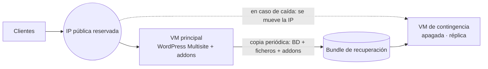

# 01 · Máquina de contingencia para un WordPress Multisite en Oracle Cloud

**Contexto:** tres webs de venta de entradas en un WordPress Multisite, más los microservicios de entrega de entradas ([ticket-delivery-addon](https://github.com/BreixoHR/ticket-delivery-addon)), en una única VM de Oracle Cloud. Si esa VM caía o era atacada, la venta se paraba en las tres webs.

**Objetivo:** recuperar la venta en minutos, sin pagar un segundo servidor encendido todo el año y sin depender de que esté disponible la persona que montó el sistema.

## Diseño

- **Réplica en frío:** la VM de contingencia es una copia completa (base de datos, ficheros y addons) que está **apagada**. Solo cuesta el almacenamiento.
- **IP pública reservada:** el DNS no cambia. Recuperar el servicio consiste en mover la IP reservada de la VM caída a la de contingencia, así que no hay que esperar a que se propaguen cambios de DNS.
- **Certificados automáticos:** al recibir la IP, un servicio emite los certificados TLS en unos 10 minutos.
- **Rotación de credenciales en la activación:** si la caída se debe a un ataque, las credenciales de la máquina original se consideran comprometidas. El procedimiento genera credenciales nuevas, las entrega una sola vez y obliga a destruir el fichero (`shred -u`) después de guardarlas en un lugar seguro.

## Runbook (en la propia máquina, visible al iniciar sesión)

1. *(Opcional)* Actualizar el sistema.
2. *(Opcional)* Cargar una copia más reciente que la de la instalación: `restaurar-copia.sh <bundle.zip>`.
3. Abrir los puertos 80 y 443 en la Security List o NSG de OCI. El firewall local ya los tiene abiertos.
4. Rotar las credenciales: `rotar-credenciales.sh`.
5. Mover la IP pública reservada de la VM original a esta.
6. Esperar unos 10 minutos y comprobar la emisión de certificados en el journal del servicio.

El runbook se muestra como **mensaje de bienvenida** de la máquina: quien entra en una emergencia ve los pasos sin buscar documentación. La fecha de la copia y la de instalación figuran en la cabecera, de modo que se sabe al momento qué antigüedad tienen los datos que se van a restaurar.

## Lecciones

- Una contingencia que solo sabe activar una persona no es una contingencia. El runbook está pensado para que lo ejecute **otra persona** bajo presión.
- La IP reservada simplificó más que cualquier automatización, porque elimina la variable del DNS.
- **Pendiente:** automatizar la copia periódica hacia la máquina de contingencia y ensayar la activación cada trimestre.
