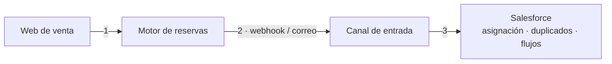

# 04 · Protocolo de pruebas de extremo a extremo: motores de reserva → Salesforce

**Contexto:** las reservas llegan a Salesforce desde cinco motores (Regiondo, FareHarbor, Viator, Ventrata y TuriTop), cada uno por un canal distinto: webhook, correo entrante o integración directa. Cada cambio, y cada temporada alta, exigía confirmar que **una reserva hecha en la web llega íntegra al CRM**. Hasta entonces se hacía de forma improvisada.

## Principio rector

> Toda prueba que dispare automatizaciones (creación de casos, parsing de correos, flujos, reglas de asignación) se ejecuta contra un **buzón de sistemas dedicado**, nunca contra un cliente real ni contra el buzón de soporte en producción. Después de verificarla, **se borra el rastro**.

Este principio evita tres problemas: contaminar las colas de soporte con tickets de prueba, disparar comisiones o avisos a proveedores por reservas ficticias, y dejar en el CRM datos que distorsionan los informes o duplican contactos.

## El circuito, en tres tramos que fallan por separado

Cada tramo se verifica por separado antes de dar por bueno el conjunto.

## Pasos (comunes a todos los motores)

| # | Paso | Qué se comprueba |
|---|---|---|
| 0 | Preparación | Credenciales de pruebas, modo sandbox y notificaciones apuntando al buzón de sistemas |
| 1 | Alta | Reserva con datos identificables (`PRUEBA-QA`) y hora exacta anotada |
| 2 | Notificación de origen | Que el motor emite el correo o el webhook. Se guarda el payload como evidencia |
| 3 | Llegada | Asunto, remitente e id de mensaje (Salesforce lo usa para agrupar hilos) |
| 4 | Disparo en Salesforce | Registro correcto, campos clave y cola asignada |
| 5 | Modificación | Se actualiza el registro existente, **sin duplicar** |
| 6 | Cancelación | El estado se propaga. Ojo: no todos los motores la notifican |
| 7 | Limpieza | En orden: CRM, después el buzón y después el motor. Nunca a medias |
| 8 | Evidencia | Plantilla con el motor, cada tramo, el resultado, la limpieza y el responsable |

## Particularidades descubiertas por motor

- **Regiondo:** el sandbox tiene su propia URL y sus propias claves. Firma HMAC con clave pública y privada, y en sandbox existe un modo de depuración para aislar errores 401. Tiene límites de peticiones por 24 h, así que hay que usar webhooks y no sondeos.
- **FareHarbor:** el alta del webhook no es autoservicio, la activa su soporte. Hay que probar **también la firma inválida**. Las cancelaciones hechas por API no siempre se notifican.
- **Viator:** su sandbox no está conectado a proveedores reales, así que las reservas *on request* no se pueden simular. Las cancelaciones hechas por API **no envían correo**: que no llegue nada puede ser el comportamiento esperado y no un fallo.
- **Ventrata:** usa el estándar OCTO y tiene una cabecera de modo test. El webhook de actualización trae un objeto con los campos que han cambiado, y el panel guarda el historial de reintentos de entrega.
- **TuriTop:** tiene un modo de servicio de prueba sin comisiones. El webhook de reserva devuelve la misma estructura que la API de consulta, de modo que se puede usar el mismo validador para ambos.

## Verificaciones dentro de Salesforce

Hay que comprobar cuatro cosas, primero en sandbox y después en producción:

- el **hilo de Email-to-Case**: una respuesta no crea un caso nuevo;
- las **reglas de asignación**;
- las **reglas de duplicados**: se envían a propósito dos notificaciones equivalentes;
- que la reserva se **vincula al contacto** existente por su email.

---

El protocolo se tradujo en código en el [webhook OCTO de salesforce-booking-ops](https://github.com/BreixoHR/salesforce-booking-ops): es idempotente, descarta los eventos fuera de orden y deja un registro de auditoría de cada evento.
