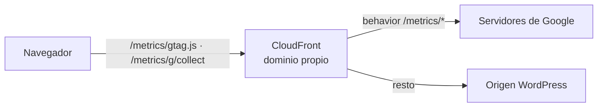

# 07 · Google Tag Gateway con CloudFront: medición servida desde dominio propio

**Contexto:** una parte de las conversiones de las webs de venta no llegaba a Google Analytics 4 ni a Google Ads. Los bloqueadores de anuncios reconocen y bloquean las peticiones a `google-analytics.com/g/collect` y `googletagmanager.com`, y esas ventas no medidas desequilibraban las pujas.

## Qué es Google Tag Gateway

Una capa de enrutado en la CDN que sirve las etiquetas de Google (GA4, Google Ads, Floodlight) **desde una ruta del propio dominio**, por ejemplo `www.example.com/metrics/…`. Para el navegador es una petición a la propia web, no a Google. Solo vale para etiquetas de Google.

## Plan de implantación (CloudFront + WordPress + GTM)

1. **Permisos:** cuenta de AWS con acceso a la distribución de CloudFront de la web, al contenedor de GTM y a las propiedades de GA4 y Ads.
2. **Ruta de medición:** que no choque con ninguna URL existente. En WordPress hay que comprobarlo contra los permalinks y los plugins. Google recomienda una cadena aleatoria corta.
3. **Activar GTG** desde la configuración de la etiqueta de Google en GTM, eligiendo CloudFront como CDN.
4. **Configurar CloudFront con Tag Assistant** ("Do it for me"): crea el origen y el *behavior* de la ruta. Antes, todo esto había que montarlo a mano con funciones Lambda@Edge.
5. **Reenvío de cabeceras:** la geolocalización y las cookies, para no empeorar la calidad del dato.
6. **Validación:**
   - `/<ruta>/healthy` debe responder `ok`;
   - en la pestaña Network, `gtag.js` y las peticiones de medición deben salir del dominio propio y no de `googletagmanager.com`;
   - GTM debe mostrar el estado "activo".
7. **Repetir en cada dominio** del portfolio y documentar la ruta usada en cada uno.

## Por qué así

- Es la vía soportada por Google: no es un proxy casero que pueda romperse al cambiar los endpoints.
- No toca WordPress (no hay plugins ni cambios de tema). Todo vive en la CDN y se puede revertir quitando el *behavior*.
- El consentimiento de cookies sigue mandando: GTG cambia **por dónde** viajan los datos, no **si** se recogen.
