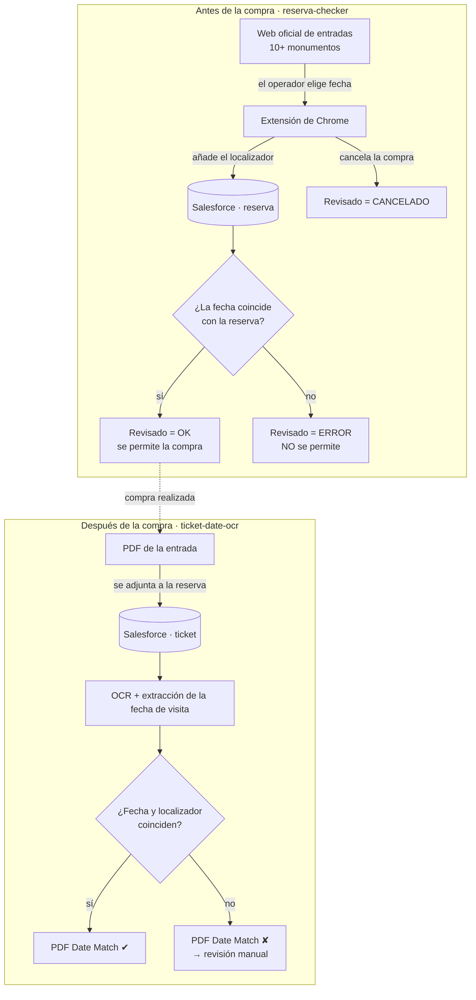

# 09 · Arquitectura: revisiones automáticas de reservas (antes y después de la compra)

**Contexto:** el equipo de operaciones compra a mano, en la web oficial de cada monumento, las entradas de cada reserva de cliente. Hay dos puntos donde se cometían errores caros:

1. **Antes de comprar:** elegir en la web oficial una fecha distinta a la de la reserva.
2. **Después de comprar:** subir al CRM un PDF que no corresponde (otra fecha u otro localizador).

**Diseño (mayo de 2026):** un control automático en cada punto, con una única fuente de verdad: el campo de revisión de la reserva en Salesforce.

## Decisiones

- **Prevenir antes que detectar:** el control previo a la compra **bloquea** el error, en lugar de avisar después, cuando la entrada ya está pagada y hay que gestionar un cambio o una devolución con el proveedor.
- **Tres estados explícitos** (`OK`, `ERROR`, `CANCELADO`) en lugar de un booleano. Así se distingue "verificado y correcto", "se intentó comprar mal" y "se abandonó la compra", lo que permite tener informes de calidad por operador y por web.
- **Doble comprobación independiente:** la segunda capa valida el **documento real** emitido por el proveedor, no lo que el operador seleccionó. Esto cubre los errores del propio proveedor.
- **La IA y el OCR, solo donde aportan:** antes de la compra basta con leer el DOM de la web. El OCR se reserva para los PDF, que muchas veces son imágenes escaneadas.

## Implementación

- Antes de la compra: [reserva-checker](https://github.com/BreixoHR/reserva-checker), extensión MV3 con un endpoint Apex REST.
- Después de la compra: [ticket-date-ocr](https://github.com/BreixoHR/ticket-date-ocr), servicio OCR con un Queueable en Salesforce.
