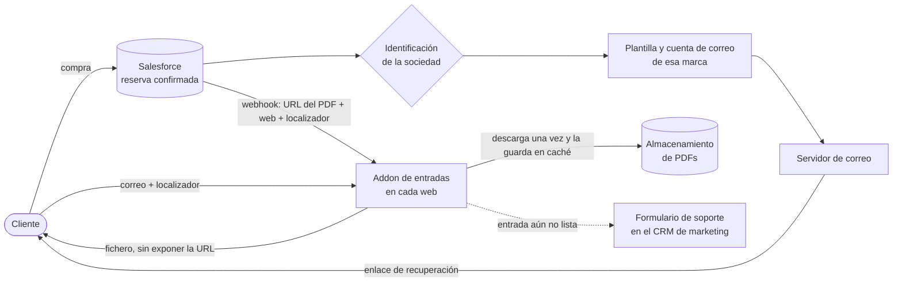

# 10 · Arquitectura: nuevo sistema de entrega y recuperación de entradas

**Contexto (septiembre de 2026):** las entradas se enviaban al cliente con el enlace directo al PDF guardado en la nube. Había tres problemas:

- el enlace exponía el almacenamiento interno;
- si una entrada se regeneraba, el cliente seguía teniendo el enlace antiguo;
- cada empresa del grupo, con su marca y su web, necesitaba enviar desde su propia cuenta de correo y con su plantilla.

## Decisiones

- **Un addon por web, desacoplado de WordPress:** se instala junto a cualquier web sin tocar su base de datos y clona su cabecera y pie, de modo que el cliente siente que está en la web de la marca con la que compró.
- **La URL del PDF nunca sale del servidor:** el cliente recibe el fichero. Si la entrada se regenera, el webhook invalida la caché y la siguiente descarga ya trae la versión nueva.
- **Sociedad → plantilla → cuenta de correo:** el mismo flujo sirve a todas las empresas del grupo sin duplicar automatizaciones.
- **Si la entrada aún no está lista,** se muestra una página de "en preparación" con un formulario de soporte, en lugar de un error. Esto redujo las consultas de "no me ha llegado la entrada".

## Implementación

[ticket-delivery-addon](https://github.com/BreixoHR/ticket-delivery-addon): Node, Express y SQLite, con tokens de un solo uso e i18n en 7 idiomas.
