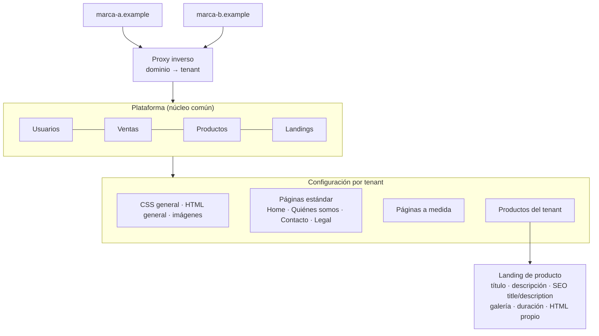

# 11 · Diseño: plataforma multitenant para las webs de las marcas del grupo

**Contexto (junio de 2026):** el grupo opera varias marcas de tours y entradas, cada una con su web WordPress independiente. Cada web nueva suponía otra instalación, otro tema y otro mantenimiento, y los productos se daban de alta varias veces.

**Propuesta:** una única plataforma con **tenants** (una marca = un tenant) que comparten el catálogo, la venta y los usuarios, y que se diferencian solo por su configuración y sus *landings*.

## Decisiones de diseño

- **Una sola fuente para los productos:** un producto se da de alta una vez y cada tenant decide cuáles publica y con qué *landing*. Se acaban los catálogos duplicados.
- **Páginas estándar con valores por defecto y páginas a medida:** una marca nueva arranca con todas las páginas estándar heredadas y solo personaliza lo que la diferencia.
- **El proxy inverso como frontera:** el dominio decide el tenant y la aplicación no necesita saber cuántas marcas existen.
- **El SEO, por tenant y por producto:** títulos y descripciones propios en cada *landing*, para que las marcas no compitan entre sí con contenido duplicado.

## Estado

Fase de diseño. El modelo de datos de **Extras de producto** que desarrollé en Salesforce (información práctica reutilizable entre productos) sigue la misma idea de definir una vez y reutilizar en cada canal.
